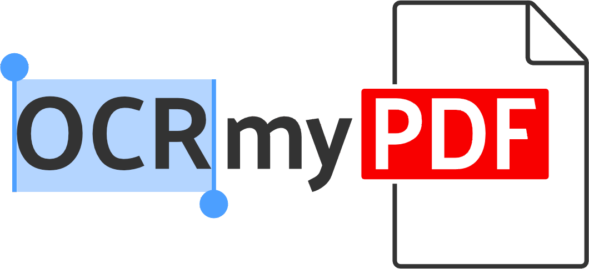

<!-- PROJECT SHIELDS -->
<!--
*** I'm using markdown "reference style" links for readability.
*** Reference links are enclosed in brackets [ ] instead of parentheses ( ).
*** See the bottom of this document for the declaration of the reference variables
*** for contributors-url, forks-url, etc. This is an optional, concise syntax you may use.
*** https://www.markdownguide.org/basic-syntax/#reference-style-links
-->

[![Contributors][contributors-shield]][contributors-url]
[![Forks][forks-shield]][forks-url]
[![Stargazers][stars-shield]][stars-url]
[![Issues][issues-shield]][issues-url]
[![MIT License][license-shield]][license-url]


<!-- PROJECT LOGO -->
<br />
<p align="center">
  <a href="https://github.com/greydongilmore/ocr-pdf">
    
  </a>

  <h3 align="center">OCR PDF</h3>

  <p align="center">
    PDF OCR conversion tool
    <br />
    <a href="https://github.com/greydongilmore/ocr-pdf"><strong>Explore the docs »</strong></a>
    <br />
    <br />
    <a href="https://github.com/greydongilmore/ocr-pdf/issues">Report Bug</a>
    ·
    <a href="https://github.com/greydongilmore/ocr-pdf/issues">Request Feature</a>
  </p>
</p>


<!-- TABLE OF CONTENTS -->
<details open="open">
  <summary><h2 style="display: inline-block">Table of Contents</h2></summary>
  <ol>
    <li>
      <a href="#about-the-project">About The Project</a>
      <ul>
        <li><a href="#built-with">Built With</a></li>
      </ul>
    </li>
    <li>
      <a href="#getting-started">Getting Started</a>
      <ul>
        <li><a href="#prerequisites">Prerequisites</a></li>
        <li><a href="#installation">Installation</a></li>
      </ul>
    </li>
    <li><a href="#usage">Usage</a></li>
    <li><a href="#contributing">Contributing</a></li>
    <li><a href="#license">License</a></li>
    <li><a href="#contact">Contact</a></li>
    <li><a href="#acknowledgements">Acknowledgements</a></li>
  </ol>
</details>


<!-- ABOUT THE PROJECT -->
## About The Project

This code snippet will search a given directory for PDF files that are non-searchable and convert them to searchable PDFs (OCR). When you obtain manuscript PDF files from online databases, they may not be in a searchable format. This means you are unable to highlight and search for text within the PDF. This small Python function will recursively search though a directory containing PDF files, determine the PDF files that are non-searchable, and convert to a searchable format. Optical Character Recognition (OCR) is a method to enable text recognition within images and documents. PDFs contain vector graphics that can contain raster objects (.png, .jpg etc.). The OCR process will first rasterize each page of the PDF file then an OCR "layer" is created. 

This python function wraps the command-line program <a href="https://ocrmypdf.readthedocs.io/en/latest/index.html" target="_blank"><strong>OCRmyPDF</strong></a>.

### Built With

* Python version: 3.9


<!-- GETTING STARTED -->
## Getting Started

To get a local copy up and running follow these simple steps.

### Prerequisites

* Install <a href="https://ocrmypdf.readthedocs.io/en/latest/installation.html" target="_blank"><strong>OCRmyPDF</strong></a>

### Installation

1. In a terminal, clone the repo by running:
    ```sh
    git clone https://github.com/greydongilmore/ocr-pdf.git
    ```

2. Change into the project directory (update path to reflect where you stored this project directory):
    ```sh
    cd /home/user/Documents/Github/ocr-pdf
    ```

3. Install the required Python packages:
    ```sh
    python -m pip install -r requirements.txt
    ```


<!-- USAGE EXAMPLES -->
## Usage

1. In a terminal, move into the project directory
     ```sh
     cd /home/user/Documents/Github/ocr-pdf
     ```

2. Run the following to execute the epoch script:
    ```sh
    python main.py -i "full/path/to/PDF/storage/diectory"
    ```

  * **-i:** full directory path to the PDF storage directory


<!-- CONTRIBUTING -->
## Contributing

Contributions are what make the open source community such an amazing place to be learn, inspire, and create. Any contributions you make are **greatly appreciated**.

1. Fork the Project
2. Create your Feature Branch (`git checkout -b feature/AmazingFeature`)
3. Commit your Changes (`git commit -m 'Add some AmazingFeature'`)
4. Push to the Branch (`git push origin feature/AmazingFeature`)
5. Open a Pull Request


<!-- LICENSE -->
## License

Distributed under the MIT License. See `LICENSE` for more information.


<!-- CONTACT -->
## Contact

Greydon Gilmore - [@GilmoreGreydon](https://twitter.com/GilmoreGreydon) - greydon.gilmore@gmail.com

Project Link: [https://github.com/greydongilmore/ocr-pdf](https://github.com/greydongilmore/ocr-pdf)


<!-- ACKNOWLEDGEMENTS -->
## Acknowledgements

* README format was adapted from [Best-README-Template](https://github.com/othneildrew/Best-README-Template)


<!-- MARKDOWN LINKS & IMAGES -->
<!-- https://www.markdownguide.org/basic-syntax/#reference-style-links -->
[contributors-shield]: https://img.shields.io/github/contributors/greydongilmore/ocr-pdf.svg?style=for-the-badge
[contributors-url]: https://github.com/greydongilmore/ocr-pdf/graphs/contributors
[forks-shield]: https://img.shields.io/github/forks/greydongilmore/ocr-pdf.svg?style=for-the-badge
[forks-url]: https://github.com/greydongilmore/ocr-pdf/network/members
[stars-shield]: https://img.shields.io/github/stars/greydongilmore/ocr-pdf.svg?style=for-the-badge
[stars-url]: https://github.com/greydongilmore/ocr-pdf/stargazers
[issues-shield]: https://img.shields.io/github/issues/greydongilmore/ocr-pdf.svg?style=for-the-badge
[issues-url]: https://github.com/greydongilmore/ocr-pdf/issues
[license-shield]: https://img.shields.io/github/license/greydongilmore/ocr-pdf.svg?style=for-the-badge
[license-url]: https://github.com/greydongilmore/ocr-pdf/blob/master/LICENSE.txt
